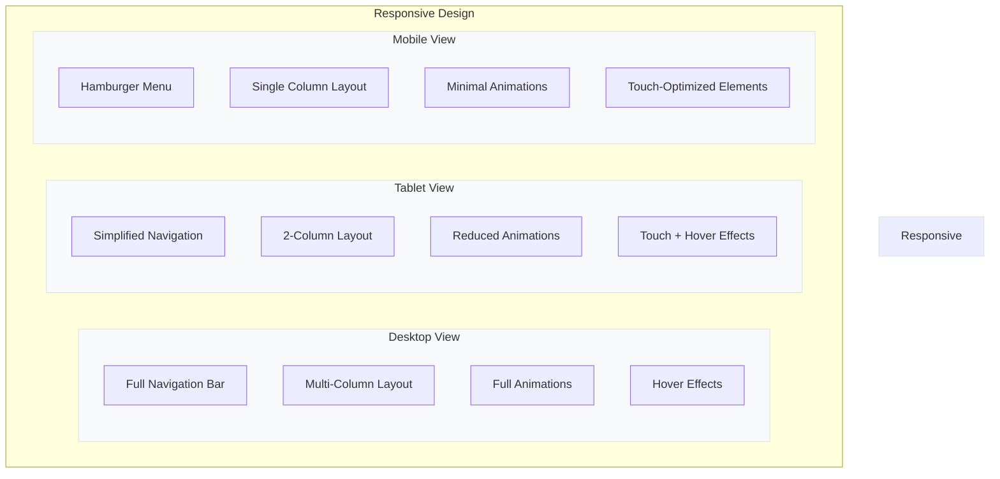

# Atomio Technologies Website

## Project Overview
Atomio Technologies is a dynamic startup focused on innovation and growth. This repository contains the codebase for our official website, designed to showcase our products, services, and company vision.

This project follows a frontend-first development approach, with the backend implementation planned for a later phase. The repository is organized into two main directories:

- `frontend/`: Contains the React application built with Vite and styled with Tailwind CSS
- `backend/`: Will contain the Supabase backend code (to be implemented in a future phase)

## Design Specifications

### Visual Design

#### Color Palette
- **Primary Color**: Red (#ea0e0e) - Used for the logo and primary actions
- **Secondary Color**: Light Blue (#f0f4f8) - Used for backgrounds and subtle accents
- **Background Colors**: Gradient from White (#ffffff) to Light Blue (#f0f4f8)
- **Text Colors**: Dark Charcoal (#212529) for body text

#### Typography
- **Headings**: Montserrat Bold (sizes: H1: 48px, H2: 36px, H3: 24px)
- **Body Text**: Inter Regular (16px)
- **Navigation**: Inter Medium (18px)
- **Call-to-Action Buttons**: Montserrat SemiBold (18px)
- **Line Height**: 1.6 for optimal readability

#### UI Elements
- **Buttons**: Rounded corners (8px radius), subtle hover animations with 300ms transition
- **Cards**: Soft shadows (0px 4px 12px rgba(0, 0, 0, 0.08)), rounded corners (12px)
- **Navigation**: Fixed transparent header that becomes solid on scroll
- **Dividers**: Subtle gradient lines using secondary and accent colors
- **Icons**: Custom SVG icons with consistent 24px sizing

### Layout & Structure

#### Website Section Order
The website will follow this specific section order:
1. Hero Section
2. Featured Projects
3. About Section
4. Services Section
5. Our Approach
6. Blog/Resources
7. Footer with Contact Form

#### Homepage
- **Hero Section**:
  - Split-screen layout (50/50) with content on left, visual element on right
  - Left section contains tagline "Innovation Without Limits" and dynamic text animation
  - Main headline: "We build and support the [dynamic text] that keeps you working smarter, growing faster, and staying ahead"
  - Dynamic text transitions between: "technology", "software", "apps", "websites", "databases", "AI solutions" with smooth fade transitions (2-3 second intervals)
  - Prominent CTA button below the headline
  - Subtle gradient background flowing from white (#ffffff) to very light blue (#f0f4f8) with hints of red accents
  - Optional geometric pattern or grid overlay at 5-10% opacity
  - Right section features abstract 3D visualization showing interconnected nodes or digital network using brand colors

  ```mermaid
  graph TD
    subgraph Hero Section
      subgraph Header
        A[Logo] --- B[Navigation Menu]
        B --- C[Contact Button]
      end

      subgraph Content [Left Side - 50%]
        D[Tagline: "Innovation Without Limits"]
        E[Main Headline with Dynamic Text]
        F[CTA Button]
        D --> E --> F
      end

      subgraph Visual [Right Side - 50%]
        G[Abstract 3D Visualization]
      end

      Header --> Content
      Header --> Visual
    end

    style Hero Section fill:#f0f4f8,stroke:#dee2e6
    style Header fill:#ffffff,stroke:#dee2e6
    style Content fill:#ffffff,stroke:#dee2e6
    style Visual fill:#ffffff,stroke:#dee2e6
  ```

- **Header/Navigation**:
  - Sticky header with logo, main navigation, and contact button
  - Main navigation includes: Services (dropdown), Products (dropdown), Case Studies, About Us, Blog
  - Clean, minimal design with adequate spacing between elements
  - Subtle shadow on scroll for depth

  ```mermaid
  graph LR
    subgraph Header
      A[Logo] --- B[Services ▾]
      B --- C[Products ▾]
      C --- D[Case Studies]
      D --- E[About Us]
      E --- F[Blog]
      F --- G[Contact Us Button]
    end

    style Header fill:#ffffff,stroke:#dee2e6
    style G fill:#3A0CA3,color:#ffffff
  ```

  ```mermaid
  graph TD
    subgraph Services Section
      A[Section Heading: "Our Services"]
      B[Subtitle: "End-to-end technology solutions tailored for modern businesses"]

      subgraph ServiceGrid [Service Cards Grid]
        subgraph Row1
          C1[Service Card 1] --- C2[Service Card 2] --- C3[Service Card 3]
        end

        subgraph Row2
          D1[Service Card 4] --- D2[Service Card 5] --- D3[Service Card 6]
        end

        subgraph ServiceCard [Service Card Structure]
          E1[Service Icon/Illustration]
          E2[Service Title]
          E3[Service Description]
          E4[Learn More Link]

          E1 --> E2 --> E3 --> E4
        end
      end

      A --> B --> ServiceGrid
    end

    style Services Section fill:#ffffff,stroke:#dee2e6
    style ServiceGrid fill:#f8f9fa,stroke:#dee2e6
    style Row1 fill:#f8f9fa,stroke:none
    style Row2 fill:#f8f9fa,stroke:none
    style ServiceCard fill:#ffffff,stroke:#dee2e6,stroke-width:1px
  ```

  ### Core Services

  1. **Database Management**
     - *Description:* Expert design, implementation, and optimization of database systems that keep your information secure, accessible, and efficient.
     - *Key Features:* Database architecture & design, Performance optimization, Migration & integration, Security implementation, Monitoring & maintenance

  2. **Web & App Development**
     - *Description:* Custom web and mobile applications that deliver exceptional user experiences while solving real business challenges.
     - *Key Features:* Progressive web applications, Cross-platform mobile apps, UI/UX design, API development, Performance optimization

  3. **AI Integration**
     - *Description:* Practical AI solutions that transform your data into actionable insights and automate complex processes.
     - *Key Features:* Machine learning implementation, Natural language processing, Computer vision solutions, Predictive analytics, AI-powered automation

  4. **Software Development**
     - *Description:* Bespoke software solutions that streamline operations, reduce costs, and create competitive advantages.
     - *Key Features:* Custom software development, Legacy system modernization, Enterprise software integration, DevOps implementation, Quality assurance & testing

  5. **IoT & Sensor Systems**
     - *Description:* Connected device ecosystems that gather valuable data and enable smart decision-making across industries.
     - *Key Features:* IoT architecture & implementation, Sensor network deployment, Real-time monitoring systems, Data collection & analytics, Remote management solutions

  6. **Cloud Solutions**
     - *Description:* Scalable, secure, and cost-effective cloud infrastructure and migration services.
     - *Key Features:* Cloud migration strategy, Multi-cloud management, Infrastructure as code, Cloud security implementation, Optimization & cost management

- **About Section**: Split-screen design with image on left, text on right

  ```mermaid
  graph LR
    subgraph About Section
      subgraph Left [Left Side - 50%]
        A[Company Image/Illustration]
      end

      subgraph Right [Right Side - 50%]
        B[Section Heading]
        C[Company Description]
        D[Key Points List]
        E[Secondary CTA]
        B --> C --> D --> E
      end
    end

    style About Section fill:#f8f9fa,stroke:#dee2e6
    style Left fill:#ffffff,stroke:#dee2e6
    style Right fill:#ffffff,stroke:#dee2e6
  ```

- **Testimonials**: Carousel slider with customer quotes and profile images

  ```mermaid
  graph TD
    subgraph Testimonials Section
      A[Section Heading]

      subgraph Carousel
        B[Left Arrow] --- C[Testimonial 1]
        C --- D[Testimonial 2]
        D --- E[Testimonial 3]
        E --- F[Right Arrow]

        subgraph Testimonial 2
          G[Quote]
          H[Customer Name]
          I[Customer Position]
          J[Company]
          K[Profile Image]
        end
      end

      subgraph Indicators
        L[Dot 1] --- M[Dot 2] --- N[Dot 3]
      end
    end

    style Testimonials Section fill:#ffffff,stroke:#dee2e6
    style Carousel fill:#f8f9fa,stroke:#dee2e6
    style Testimonial 2 fill:#ffffff,stroke:#dee2e6
  ```

- **Featured Projects Section**: Comprehensive showcase of client projects and Atomio products

  ```mermaid
  graph TD
    subgraph Projects Section
      A[Section Heading: "Featured Projects"]
      B[Subtitle: "Innovative solutions powering businesses across industries"]

      subgraph Filtering
        C1[View All] --- C2[Client Projects] --- C3[Our Products]
        D[Secondary Filters/Tags as Pills]
      end

      subgraph ProjectGrid [Project Cards Grid]
        E1[Project Card 1] --- E2[Project Card 2] --- E3[Project Card 3]
        E4[Project Card 4] --- E5[Project Card 5] --- E6[Project Card 6]

        subgraph ProjectCard [Project Card Structure]
          F1[Visual Element/Screenshot]
          F2[Project Name]
          F3[Client Name/Atomio Product]
          F4[Brief Description]
          F5[Technology Tags]
          F6[View Details Button on Hover]
        end
      end

      subgraph FeaturedProject [Featured Project Highlight]
        G1[Larger Screenshot/Mockup]
        G2[Extended Project Details]
        G3[Challenge & Solution]
        G4[Key Technologies]
        G5[Results/Impact]
        G6[View Case Study CTA]
      end

      H[Load More Projects Button]

      A --> B
      B --> Filtering
      Filtering --> ProjectGrid
      Filtering --> FeaturedProject
      ProjectGrid --> H
    end

    style Projects Section fill:#ffffff,stroke:#dee2e6
    style Filtering fill:#f8f9fa,stroke:#dee2e6
    style ProjectGrid fill:#f8f9fa,stroke:#dee2e6
    style ProjectCard fill:#ffffff,stroke:#dee2e6,stroke-width:2px
    style FeaturedProject fill:#ffffff,stroke:#3A0CA3,stroke-width:1px
  ```

  ### Example Project Cards Content

  1. **Foresta - Environmental Monitoring**
     - *Type:* Atomio Product
     - *Description:* AI-powered forest management platform using satellite imagery and IoT sensors to monitor biodiversity and detect illegal logging.
     - *Tags:* AI, IoT, Satellite Data, Environmental

  2. **Zola - Event Management**
     - *Type:* Atomio Product
     - *Description:* Comprehensive event management solution for planning, ticketing, and attendee engagement.
     - *Tags:* Web App, Mobile, Database

  3. **Omniverse - Security Intelligence**
     - *Type:* Atomio Product
     - *Description:* Natural language search for CCTV footage, enhancing security for schools, hospitals, and public spaces.
     - *Tags:* AI, Computer Vision, Security

  4. **Ocean Data Analysis Tool**
     - *Type:* Client Project
     - *Description:* Visual analytics platform for oceanographic data with workflow management for marine research.
     - *Tags:* Data Visualization, Analytics, Scientific

  5. **Airport FID Network Integration**
     - *Type:* Client Project
     - *Description:* Automated FIDS integration system reducing network downtime and improving airport operations.
     - *Tags:* Network Systems, Automation, Infrastructure

  6. **Construction Workforce Management**
     - *Type:* Client Project/Product
     - *Description:* Digital platform streamlining workforce management for construction projects.
     - *Tags:* Mobile App, Workforce Management, Database

  ### Individual Project Pages

  Each project page includes:
  - Full case study with problem statement
  - Approach and solution
  - Technologies used (with visual icons)
  - Results and impact metrics
  - Client testimonial (if available)
  - Multiple screenshots/visuals
  - "Contact Us About Similar Projects" CTA

- **Our Approach Section**: Horizontal cards highlighting the Atomio advantage

  ```mermaid
  graph TD
    subgraph Approach Section
      A[Section Heading: "The Atomio Advantage"]

      subgraph ApproachCards [Approach Cards Row]
        subgraph Row1
          B1[Card 1] --- B2[Card 2]
        end

        subgraph Row2
          C1[Card 3] --- C2[Card 4]
        end

        subgraph ApproachCard [Approach Card Structure]
          D1[Title: "Strategic Partnership"]
          D2[Description: "We become an extension of your team, with a focus on long-term success, not just deliverables."]
          D3[Icon/Image]

          D1 --- D2
          D1 --- D3
        end
      end

      A --> ApproachCards
    end

    style Approach Section fill:#f9f9f9,stroke:#dee2e6
    style ApproachCards fill:#f9f9f9,stroke:none
    style Row1 fill:#f9f9f9,stroke:none
    style Row2 fill:#f9f9f9,stroke:none
    style ApproachCard fill:#ffffff,stroke:#dee2e6,stroke-width:1px
  ```

  ### Approach Cards Content

  1. **Strategic Partnership**
     - *Description:* We become an extension of your team, with a focus on long-term success, not just deliverables.
     - *Icon:* Partnership handshake

  2. **Local Expertise, Global Impact**
     - *Description:* Based in Kenya with experience serving clients across Africa and beyond.
     - *Icon:* Global map highlighting Africa

  3. **End-to-End Solutions**
     - *Description:* From concept to deployment and maintenance, we handle every aspect of your technology needs.
     - *Icon:* Complete solution cycle

  4. **Innovation with Purpose**
     - *Description:* Technology that solves real problems and creates meaningful business impact.
     - *Icon:* Innovation lightbulb

- **Blog/Resources Section**: Grid layout showcasing insights and resources

  ```mermaid
  graph TD
    subgraph Blog Section
      A[Section Heading: "Insights & Resources"]
      B[Subtitle: "Explore our latest thinking on technology, innovation, and business transformation"]

      subgraph BlogGrid [Blog Cards Grid]
        subgraph Row1
          C1[Blog Card 1] --- C2[Blog Card 2] --- C3[Blog Card 3]
        end

        subgraph Row2
          D1[Blog Card 4] --- D2[Blog Card 5] --- D3[Blog Card 6]
        end

        subgraph BlogCard [Blog Card Structure]
          E1[Title with Arrow]
          E2[Description]
          E3[Image]

          E1 --> E2
          E2 --> E3
        end
      end

      A --> B --> BlogGrid
    end

    style Blog Section fill:#f8f9fa,stroke:#dee2e6
    style BlogGrid fill:#f8f9fa,stroke:none
    style Row1 fill:#f8f9fa,stroke:none
    style Row2 fill:#f8f9fa,stroke:none
    style BlogCard fill:#ffffff,stroke:#dee2e6,stroke-width:1px
  ```

  ### Blog/Resources Cards Content

  1. **Tech Blog**
     - *Description:* Insights on emerging technologies and best practices in software development

  2. **Case Studies**
     - *Description:* Real-world examples of innovative solutions we've delivered for our clients

  3. **Industry Reports**
     - *Description:* Data-driven analysis of trends shaping business and technology in Africa and beyond

  4. **Events**
     - *Description:* Upcoming webinars, workshops, and industry conferences where you can meet our team

  5. **Resource Library**
     - *Description:* Free guides, templates, and tools to help your business leverage technology

  6. **Newsletter**
     - *Description:* Monthly updates on tech innovations, company news, and industry insights

- **Footer with Contact Form**: Clean, minimal footer with three main sections

  ```mermaid
  graph TD
    subgraph Footer
      subgraph MainFooter [Main Footer Content]
        subgraph CompanyInfo [Company Information]
          A1[Logo]
          A2[Tagline: "Innovation without limits"]
          A3[Social Media Icons]
        end

        subgraph QuickLinks [Quick Links]
          B1[Services]
          B2[Products]
          B3[Case Studies]
          B4[About Us]
          B5[Careers]
          B6[Blog]
        end

        subgraph ContactSection [Contact Section]
          C1[Contact Heading]
          C2[Contact Description]

          subgraph ContactForm [Contact Form]
            D1[Name Field]
            D2[Email Field]
            D3[Message Field]
            D4[Submit Button]

            D1 --> D2 --> D3 --> D4
          end
        end

        CompanyInfo --- QuickLinks --- ContactSection
      end

      subgraph BottomBar [Bottom Bar]
        E1[Copyright Text]
        E2[Privacy Policy]
        E3[Terms of Service]
        E4[Cookie Policy]

        E1 --- E2 --- E3 --- E4
      end

      MainFooter --> BottomBar
    end

    style Footer fill:#f8f9fa,stroke:#dee2e6
    style MainFooter fill:#f8f9fa,stroke:none
    style BottomBar fill:#f0f0f0,stroke:#dee2e6
    style CompanyInfo fill:#f8f9fa,stroke:none
    style QuickLinks fill:#f8f9fa,stroke:none
    style ContactSection fill:#f8f9fa,stroke:none
    style ContactForm fill:#ffffff,stroke:#dee2e6,stroke-width:1px
    style D4 fill:#3A0CA3,color:#ffffff
  ```

  ### Footer Content

  - **Company Information**
    - Logo
    - Tagline: "Innovation without limits"
    - Social media icons

  - **Quick Links**
    - Services
    - Products
    - Case Studies
    - About Us
    - Careers
    - Blog

  - **Contact Form**
    - Simple form with Name, Email, Message fields
    - Submit button in brand color

  - **Bottom Bar**
    - Copyright text: "© 2025 Atomio Technologies. All Rights Reserved."
    - Privacy Policy, Terms of Service, Cookie Policy links

  - **Additional Elements**
    - Office location with map pin icon
    - Business hours
    - Phone number with country code
    - "Made in Kenya" badge

#### Responsive Behavior
- **Desktop**: Full-featured experience with animations and hover effects
- **Tablet**: Simplified grid layouts, reduced animations
- **Mobile**: Single-column layout, condensed navigation into hamburger menu, touch-optimized interactive elements



#### Animation & Interaction
- **Scroll Effects**: Subtle fade-in and slide-up animations as elements enter viewport
- **Hover States**: Scale transformations (1.02) for cards, color transitions for buttons
- **Page Transitions**: Smooth cross-fades between pages (500ms)
- **Loading States**: Custom animated spinner using the brand colors

```mermaid
graph TD
  subgraph Animation & Interaction
    subgraph Scroll [Scroll Effects]
      A1[Initial State: Hidden/Transparent]
      B1[Scrolled Into View]
      C1[Final State: Visible with Slide-up]
      A1 --> B1 --> C1
    end

    subgraph Hover [Hover States]
      A2[Normal State]
      B2[Hover State: Scale 1.02]
      C2[Hover State: Color Transition]
      A2 --> B2
      A2 --> C2
    end

    subgraph Transition [Page Transitions]
      A3[Current Page Fade Out]
      B3[Loading Indicator]
      C3[New Page Fade In]
      A3 --> B3 --> C3
    end

    subgraph Loading [Loading States]
      A4[Spinner Animation]
      B4[Progress Indicator]
      C4[Content Reveal]
      A4 --> B4 --> C4
    end
  end

  style Animation & Interaction fill:#ffffff,stroke:#dee2e6
  style Scroll fill:#f8f9fa,stroke:#dee2e6
  style Hover fill:#f8f9fa,stroke:#dee2e6
  style Transition fill:#f8f9fa,stroke:#dee2e6
  style Loading fill:#f8f9fa,stroke:#dee2e6
```

## Tech Stack

### Frontend
- **Framework**: React with Vite for fast development and optimized performance
- **Language**: TypeScript for type safety
- **Styling**: Tailwind CSS for utility-first styling approach
- **State Management**: React Context API for global state
- **Animations**: CSS animations and transitions
- **Form Handling**: React Hook Form with validation

### Backend (Planned)
- **Database**: PostgreSQL via Supabase - chosen specifically for its robustness and scalability to support our startup's frequent iterations and growth
- **Authentication**: Supabase Auth with social login options
- **API**: Supabase REST and real-time subscriptions
- **Storage**: Supabase Storage for media assets

### Development Tools
- **Build Tool**: Vite for fast development experience
- **Version Control**: Git with GitHub
- **Code Quality**: ESLint, Prettier, and TypeScript for type safety
- **Testing**: Vitest and React Testing Library

### Deployment (Planned)
- **Hosting**: Netlify, Vercel, or AWS Amplify for the frontend
- **Backend**: Supabase cloud infrastructure

## Getting Started

### Prerequisites
- Node.js (v16+)
- npm or yarn
- Git

### Installation
1. Clone the repository
   ```
   git clone https://github.com/Atomio-Space/atomiowebsite.git
   cd atomiowebsite
   ```

2. Install frontend dependencies
   ```
   cd frontend
   npm install
   ```

3. Start the development server
   ```
   npm run dev
   ```

4. Open your browser and navigate to the URL shown in the terminal (typically http://localhost:5173)

## Development Workflow
1. Create a feature branch from `main`
2. Implement changes with appropriate tests
3. Submit a pull request for review
4. After approval, merge to `main` for automatic deployment

## Contributing
Please read our [Contributing Guidelines](CONTRIBUTING.md) before submitting changes.

## License
This project is proprietary and confidential. Unauthorized copying, distribution, or use is strictly prohibited.